# Introduction

## Linux

Linux是一个免费的类 unix 操作系统，基于 POSIX 和 UNIX 的多用户、多任务、支持多线程和多 CPU 的操作系统。以网络为核心，性能稳定。
<!--more-->
Windows 操作系统跟 Linux 操作系统在设计哲学上存在着巨大的区别。Windows 系统将各种功能都集中的操作系统内部，而 Linux 的内核空间与用户空间有明显的界限。Windows 的设计是为了让用户更方便的交互，所以对图形化界面 GUI 的支持特别好。Linux 操作系统以网络为核心，以文本为信息的载体，Linux 的核心设计思想为：一切皆为文件，所以它本质上是一个基于文本的命令行操作系统，图像对 Linux 系统来说是个包袱，Linux 对 GUI 的支持是很差的，GUI 在一定程度上会影响系统的稳定性，Linux 服务器均没有图形界面。

严格来讲，Linux 是指 Linux Kernel，我们平时用到的 Linux OS 一般都是基于这个 Kernel 制作的发行版（Redhat, debian, Centos, SuSE, Fedora等）。Ubuntu 基于debian，Centos 基于 Redhat，debian 基础核心小，稳定，占用资源少，Centos 去除了很多与服务器无关的应用，系统简单稳定。二者都是非常适合做服务器的操作系统。

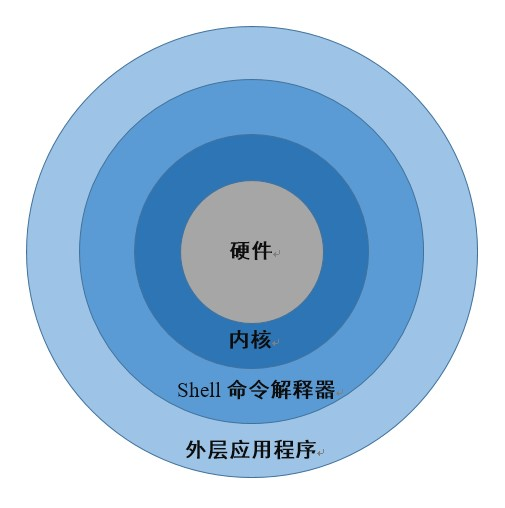

Linux 本身没有图形界面，linux 是一个基于命令行的操作系统，图形界面得益于 X windows。

## X Windows

X Windows (1984诞生于 MIT) 也被叫做“X”，“X 11”，是为了在 UNIX 系统上使用图形界面而开发的系统。X 一开始就是针对网络而设计的，采用了“client-server”模型，“X server”运行在计算机上，用来管理显示信息，处理来自键盘和鼠标的输入信息，并与其他输入输出设备交互。每一个 X 应用程序（比如 XTerm，Terminal，浏览器等）就是一个“X client”，客户给服务器发信息，例如：”请在这些坐标显示鼠标轨迹“等等。

如果只有一台计算机，那么可以在同一台计算机上运行 X server 和 X client，当有多台计算机的时候，可以在一台计算机上运行 X 应用程序，通过网络传递信息，在另一台计算机上接收信息，并由 X server 处理，由本机 X client 显示。例如 Exceed、telnet、teamviewer 等远程 X window软件。

严格地说，X 并不是一个软件，它更类似于 HTTP 协议、IP 协议，一个基于 X 的应用程序需要运行并显示内容的时候，就连接到 X 服务器，用 X 协议和服务器交谈，X 服务器提供一些接口供客户使用。同时，X 服务器还负责捕捉键盘和鼠标的动作，并通知 X 程序。

我们打开 Ubuntu 16 系统，看到的桌面系统默认为 Unity 7。常用的桌面系统还有 KDE、Gnome、xfce等。这些桌面系统都集成了 X Windows，它们与基本系统的耦合度都很低，这种低耦合的优点在于，当图形界面出问题的时候，可以进入命令行模式（ctrl+alt+F1-F6）进行修复。

**Linux 图形界面层次关系如下：**

Linux kernel  \-\-\>  X server <\-\- X 协议 \-\-\> 桌面环境 \-\-\> X 应用程序。

## Shell

shell 是命令解释器，它解释由用户输入的命令并把它们送到内核，是用户使用 Linux 的桥梁。用户通过 shell 同 kernel 交互，shell 就像是包裹在 kernel 外面的一层蛋壳，故名 shell。有很多人用不同的方式编写实现了这种命令解释器，shell 是这些软件的统称，它是独立于 Linux kernel 的一种软件，一般的 Linux 发行版都使用 Bash 解释器。

shell 软件虽然有很多种，但是它们都是使用文本指令，而且这些文本指令都是一样的。不管使用的什么发行版的系统，使用的什么类型的图形界面，文本指令都是统一的，用户可以很方便地在不同的发行版间切换，另外，文字指令在远程联机的时候有无可比拟的速度优势。因此，牢记一些常用的 shell 指令是很有必要的。

## 常用的 Bash 命令

Bash 是一个为 GNU 计划编写的 Unix shell，是在 Bourne shell(史蒂夫·伯恩于1978年编写)的基础上编写的，全称为 Bourne-Again shell(这是一个双关语 Bourne again/born again)。

### 文件与目录

前面提过，Unix/Linux 的设计思想是：一切皆文件。Linux 内的所有的一切都是以字节流的形式来呈现的，包括进程、线程、套接字、IO设备等等。所以整个 Linux 系统最重要的地方就是目录树结构。所谓的目录树结构就是以根目录为主，向下呈现分支状的目录结构。整个目录树最重要的就是根目录（root directory，表示方法为 "/"）。目录树结构如下图所示：

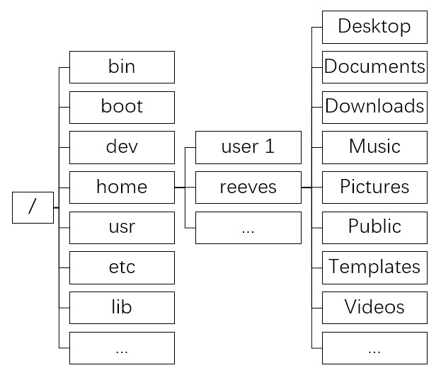

目录中不同的路径可以存储在不同的分区，这在 Linux 中叫做挂载，必须将文件所在的分区挂载到一个已存在的目录上，才能通过访问这个目录来访问存储设备。例如，根目录放在磁盘分区1，etc、lib 存储在磁盘分区2，就说分区1是挂载到根目录的，分区2是挂载到etc、lib的。

打开 shell 程序之后，我们看到如图所示：

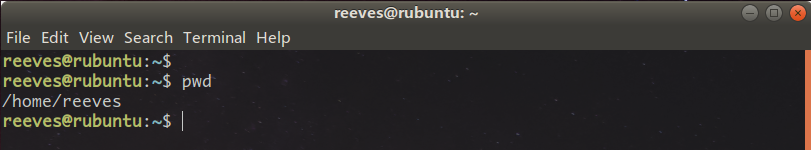

reeves 是当前用户名，rebuntu 是计算机名称，"~"表示当前所处的位置，命令 pwd 可以让我们查看当前所处位置的绝对路径：/home/reeves，第一个"/"不是分隔符，而是根目录，第二个"/"是一个分隔符，/home/reeves == ~，"~"有时候也被称为用户的主目录。

命令"ls"，可以让我们查看当前路径下都有什么：

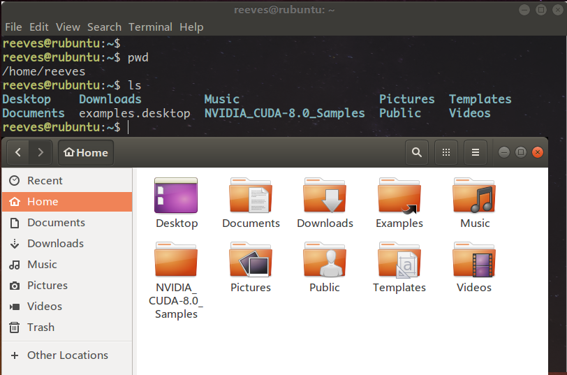

**ls** 是 list 的缩写，列出当前路径下的文件，是 Linux 中最常用的一个命令。打开文件管理器可以看到显示的就是 Home 路径。

ls 命令后面可以加参数与选项，常用的有：

* -a ：列出全部文件，包括隐藏文件（名字开头为 . 的文件）
* -l ：列出文件的信息，包含文件的属性与访问权限。显示结果共有 10 列：第1列表明文件类型，其中-代表普通文件，d代表目录文件，c代表字符设备文件，s代表套接字文件，l代表链接文件，p代表管理文件；234列表明文件所有者的读(r)写(w)和执行(x)权限；567列表明文件的组用户权限(组中除所有者外其他人)；8-10列表明其他用户的权限。

执行命令 ls -a，我们发现有两个很特殊的目录，"." 和 ".." ，在 Linux 中，"." 是指当前目录，而 ".." 是指上一级目录，cd .. 即可回到上一级目录中。

**cd** 是 Linux 系统中另外一个常用的命令，是 change directory 更换目录的缩写，直接执行 cd 而不加路径的话会默认跳转至用户主目录。cd .. 就会回到上一级目录，cd - 会跳转到上一次访问的路径。

**mkdir** 命令可以创建新的文件夹，但是文件夹必须一层一层的一次创建，例如，要创建路径： /home/reeves/WorkSpace/pySpacce/test，必须先在路径 /home/reeves 下创建 WorkSpace，然后进入 WorkSpace 中创建 pySpace，再进入 pySpace 创建 test。但是加上 -p 选项则可以自动依序创建目录。

**touch** 命令有两个作用，一是创建新的空白文件，二是将已存在的文件的时间标签修改为当前时间（或指定时间）。第一个作用是 touch 命令通常用途。第二个作用在大型项目的编译时会用到。

```shell
$touch hello.txt
```
Ubuntu 自带的程序 gedit 可以打开 hello.txt 文档，并编辑内容。在命令行查看文件内容可以用 **cat** 命令：

```shell
$cat hello.txt
```

Linux 源码中的 workqueue.c 文件，有5800多行，直接 cat workqueue.c 会显示所有的内容，一屏幕显示不下，这时候要想查看文件开头几行，可以用 **head** 命令：

```shell
$head workqueue.c
```

默认显示文件的前十行文件，要查看指定几行，可以用参数 -n：

```shell
$head -n 20 workqueue.c
```

要查看文件的后几行，可以使用 **tail** 命令：

``` shell
$tail workqueue.c
```

依然默认显示10行内容，同 head 命令一样，-n 选项可以指定查看的行数。

tail 命令有一个很实用的用法，-f 选项可以监视文件尾部内容的改动，ctrl+c 可以退出监控。

**rm** 命令（remove）的作用是删除文件，是一个十分常用但是非常危险的命令。

三个重要的选项与参数：

* -f ：就是 force 的意思，强制执行，不会出现警告信息；
* -i ：互动模式，在删除之前会询问使用者是否确定删除；
* -r ：递归删除，常用于删除目录，是一个非常危险的选项。

``` shell
$rm -rf *    # 删除当前目录下的一切文件，且不会有任何询问
```


**可执行文件**：创建 welcome.c，编译生成可执行文件 welcom，linux 下可执行文件跟 Windows 下的 exe 扩展名不一样，Linux 文件是否可以执行，可以通过 ls -l 查看文件属性是否有 x。执行文件的方法为：

``` shell
$gcc welcome.c -o welcome
$./welcome    # '.'表示当前目录，'./'表示当前目录下的可执行文件
```

### 权限

**chmod** 命令可以改变文件的权限：

```shell
$chmod 777 test    # 执行命令 ls -l test，显示结果为 -rwxrwxrwx
```

### 文本编辑

**vi/vim** 是一个文本编辑器，类 Unix 系统都会内置 vi 编辑器，vim 是 vi 的升级版本，两者的用法是一样的。

vim 一共有 3 个模式：正常模式，编辑模式，命令模式。

正常模式一般用于浏览文本，使用命令 vim a.c 即可打开文本，在这个模式中，键盘操作都不会键入相应的字符，而是执行相应的功能：

* 上下左右键和 hjkl 键可以调整光标的位置。
* ctrl+f 向下翻一页
* ctrl+b 向上翻一页
* dd 删除光标所在行
* yy 复制光标所在行
* p 粘贴
* u 撤销上一次操作
* v 可视化选择，可以通过上下左右键来扩大选中范围
* gU 选中部分变大写
* gu 选中部分变小写
* gg 跳转到文件首行
* G 跳转到文件末尾
* 数字加gg 跳转到指定行
* i 进入编辑模式(insert 模式)，按 Esc 退出编辑模式。
* ctrl+s 锁定窗口，什么操作都不会有响应 
* ctrl+q 解锁窗口

编辑模式中键盘操作均作为键盘输入，要移动光标只能用上下左右键操作：

* Esc 退出编辑模式。

如果在退出之前希望保存所作的修改，那么需要进入命令模式。按":"或者"/"即可进入。

* :w 保存
* :q 退出vim
* :wq 保存并退出
* :q! 取消修改并退出
* :set nu 显示文件的行号
* :set nonu 取消行号显示
* :sp 把当前窗口水平分割成两个窗口，后面可以加文件名 sp filename，ctrl+w+j/k上下屏切换
* :vsp 把当前窗口竖直分割成两个窗口，后面可以加文件名 vsp filename，ctrl+w+h/l左右屏切换
* /someword 匹配输入的someword，n：向后查找下一个，N：向前查找下一个


### 磁盘

**df** 命令是列出文件系统的整体磁盘空间使用情况。

参数：

* －h : 以人们易读的GB、MB、KB等格式显示。
* －ｍ：以MB为单位展示。
* －ｋ：以KB为单位展示。

**du** 命令是查看当前指定文件或目录占用的磁盘空间大小。

参数：

* -h：以KB，MB，GB等格式显示。
* -s：只显示总计。
* -m：以MB为单位展示。
* -k：以KB为单位展示。

### 压缩和打包

Linux 环境中，压缩文件的扩展名大多是：*.tar, *.tar.gz, *.tgz, *.gz, *.Z, *.bz2。

- *.Z   compress 程序压缩的文件
- *.gz   gzip 程序压缩的文件
- *.bz2   bzip2程序压缩的文件
- *.tar   tar程序打包的文件，没有经过压缩
- *.tar.gz   tar程序打包的文件，并经过gzip压缩
- *.tar.bz2  tar程序打包的文件，并经过bzip2压缩

目前主流的压缩技术只有 gzip 和 bzip2，compress 基本上已经被取代，bzip2 理论上是最新最好的压缩方法。

**gzip** 是应用最广的压缩指令。所生成的压缩文件扩展为 *.gz，压缩和解压指令为：

```shell
$gzip hello.c
$gzip -d hello.c.gz
```

-d 是 decompress的意思。

**bzip2** 可以提供更好的压缩率，生成的文件扩展为 *.bz2。压缩和解压指令为：

``` shell
$bzip2 hello.c
$bzip2 -d hello.c.bz2
```

压缩命令只能压缩单个文件，不能压缩目录，如果要压缩目录，需要用到 **tar** 打包命令。

选项与参数：

* -c ：打包目录
* -x：解包目录
* -z：用 gzip 压缩/解压
* -j：用 bzip2 压缩/解压
* -f：要处理的文件名。压缩的时候要指明压缩后的名称和要处理的目录名
* -v：处理过程中显示正在处理的文件。

在 Linux 中遇到打包压缩的文件，可以根据后缀名选择相应的命令。

### 软件下载和安装

**apt** (advanced packaging tool)是 Linux 下的一款安装包管理工具。常用的命令如下：

* apt update  从软件源服务器获取最新的软件信息并缓存到本地
* apt upgrade 从本地仓库中对比系统中所有已安装的软件，如果有新版本的话进行升级
* apt list  列出本地仓库中所有的软件包名
* apt install 安装指定的包
* apt remove 卸载指定的包，但不删除相关配置文件
* apt purge  卸载指定的包，同时删除相关配置文件
* apt autoremove  卸载目前不再依赖的孤立的包

**dpkg** (Debian packager)命令可以用来安装、删除 Debian 的软件包。与apt 不同的是，dpkg 指定的软件必须是已经下载到本地的 .deb 文件。

常用命令如下：

* dpkg -i 安装指定软件
* dpkg -r 删除软件包，保留其配置
* dpkg -P 移除软件，不保留配置

## Bash && Shell

### 数据流重定向和管道命令

数据流重定向就是将本该在屏幕上出现的内容重定向到一个文件中。具体的做法就是在命令之后添加">"或者">>"，其中">"的意思是将左侧命令产生的输出写入右侧文件中去，写入是以覆盖的方式进行的。">>"的意思是将左侧命令产生的输出写入右侧文件中去，写入是以累加的方式进行的。
```shell
$ls > result.txt    # 将 ls 的结果写入到 result.txt 中去
$cat > hello.txt    # 支持键盘输入内容到 hello.txt 文件中去
```

**；&& ||**

很多时候，我们想要一次输入多个命令时，可以用 ：

cmd1 ；cmd2；...  cmd1和cmd2直接没有相关性

cmd1 && cmd2  cmd1运行完毕且正确则运行cmd2，否则不运行

cmd1 || cmd2  若cmd1运行完毕且正确，则cmd2不运行。否则cmd2运行

**管道命令**

管道命令的符号是"|"，cmd1 | cmd2。即用 cmd2 来处理 cmd1 产生的结果。

统计目录下的文件数量：
```shell
$ls | wc -l
```
显示文件名中包含“text”的文件：
```shell
$ls | grep "text"
```


### bashrc

/etc/profile 文件是一个系统级的 profile 文件。因为 Linux 是一个多用户的系统，允许每一个用户有不同的配置文件，但是每一个使用系统的用户都会先载入 /etc/profile 的配置。这个脚本会读取 /etc/profile.d/*.sh ，这里面有一些 bash 程序的配置，命令的别名等等。

bash 在载入了整体环境配置之后再依序载入 ~/.profile 文件和 ~/.bashrc 文件。

一般对于个人用户，要想添加可执行程序的路径，或者定义 bash 命令就要修改 ~/.bashrc 文件。


# linux 常用软件安装与强化学习环境配置

## 汉语输入法

首先安装汉语语言包：

```shell
$sudo apt install language-pack-zh-hans
```

安装谷歌拼音输入法。执行这个命令，系统会自动安装 fcitx，googlepinyin，以及一些 fcitx 配置程序：

```shell
$sudo apt install fcitx-googlepinyin
```

打开 systemsettings -> Language Support，系统会自动进行语言包搜索，按照系统提示确认安装。fcitx 是一个输入法框架。如图所示，在 Keyboard input method system 中选择 fcitx：

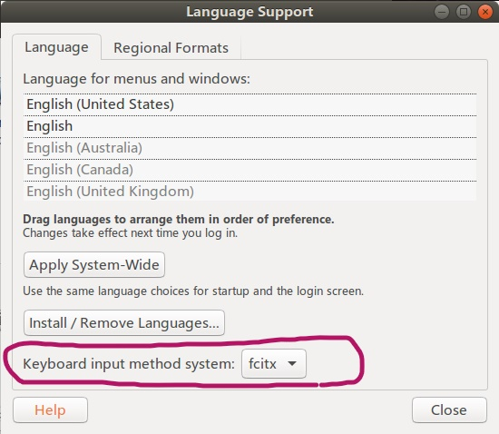

重启电脑，fcitx 输入法框架开始运行。在终端执行 fcitx-configtool，进行输入法配置。点击 "+" 添加Google Pinyin：

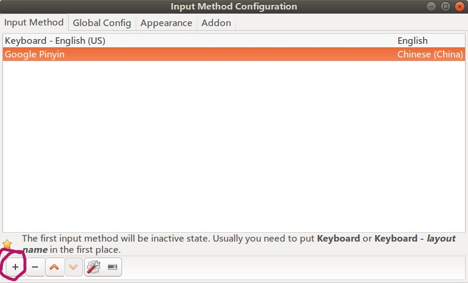

若列表里没有 Google Pinyin，需要取消 Only Show Current Language 复选框：

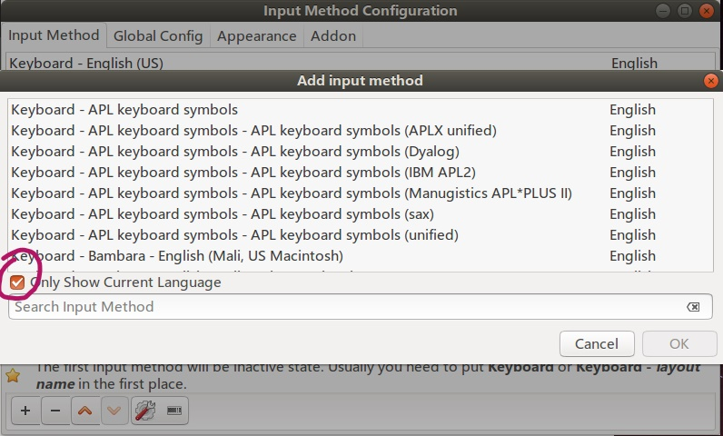

添加完输入法之后，在 Global Config 中可以看到输入法的切换方式：

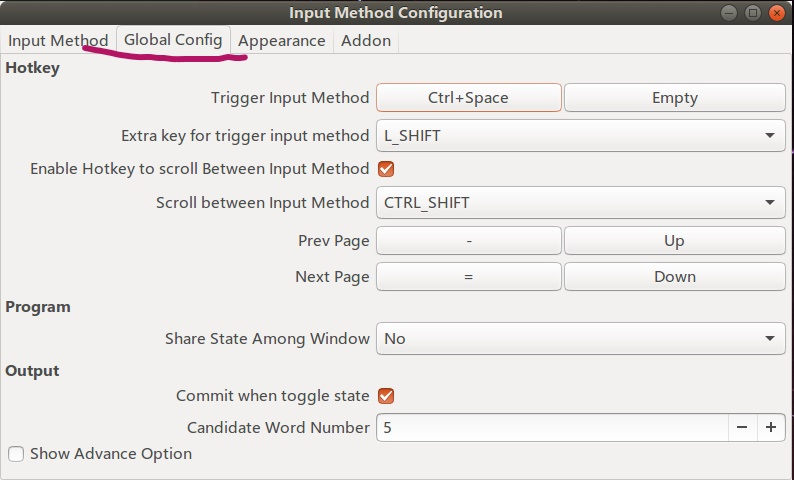

以上。

## Nvidia 驱动安装

在 All Settings ->  Details 中查看自己的设备信息，如图：

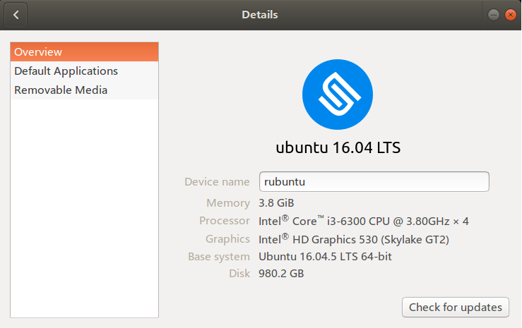

Nvidia 驱动和 CUDA 版本存在着对应关系，可以在[官网](https://docs.nvidia.com/cuda/cuda-toolkit-release-notes/index.html)查看。

[这里](https://www.geforce.com/drivers)可以查看 GPU 支持的驱动版本。

推荐使用 ppa 源安装驱动，方法如下：

首先添加 ppa 源，执行如下语句：

```shell
$sudo add-apt-repository ppa:graphics-drivers/ppa
```

获取最新的软件包源，将其添加至当前 apt 库中，执行后会显示当前可供下载的最新驱动版本号，已经老的驱动版本号。如图：

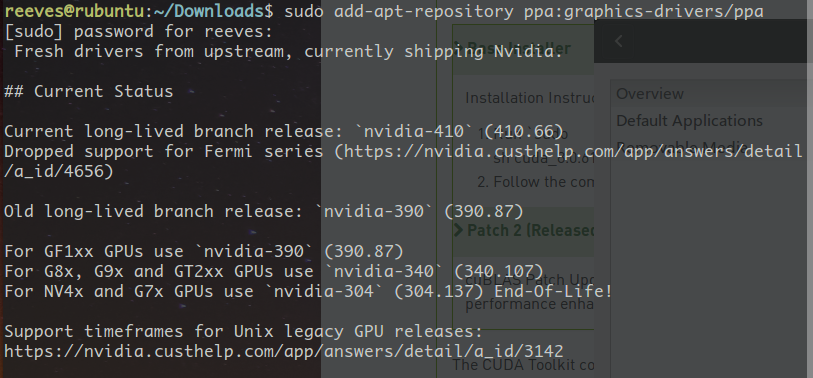

最新的版本为 nvidia-410(410.66)，稍早的版本为 nvidia-390(390.87)。更新软件库信息，并下载 Nvidia 驱动：

```shell
$sudo apt update
$sudo apt install nvidia-390
```

安装三维图像库和 OpenGL 环境，并重启：

```shell
$sudo apt install mesa-common-dev
$sudo apt install freeglut3-dev
$sudo reboot
```

在终端输入 nvidia-smi，若输出如下，则说明安装成功：

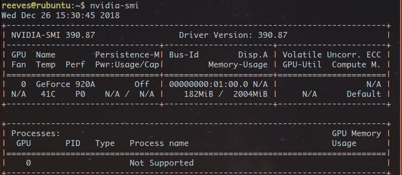

All Setting -> Details 内显示 Graphics 为 Geforce 920：

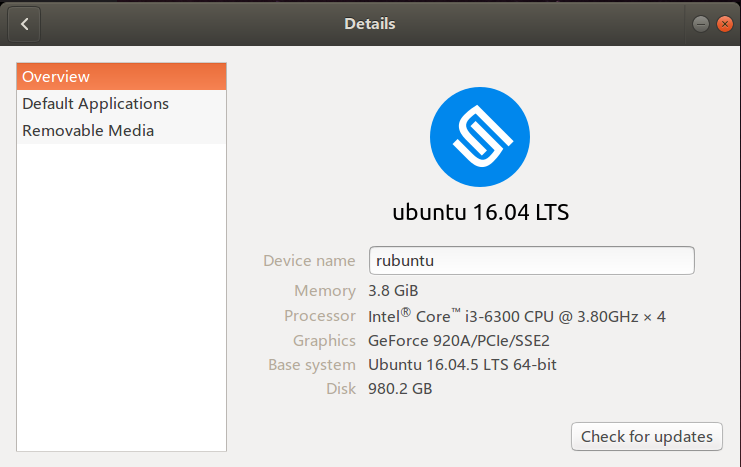


在 .bashrc 中添加路径：
```shell
$export LD_LIBRARY_PATH=$LD_LIBRARY_PATH:/usr/lib/nvidia-390
```

以上。

## CUDA 安装

以 cuda8 为例，参考[博客](https://blog.csdn.net/u010837794/article/details/63251725)。

很多博客都指出要先禁用 nouveau 服务，并加入黑名单，这个步骤很麻烦，同时也是没有必要的。首先，我们来看 nouveau 是什么。nouveau 是一个开源驱动项目，是 Linux KMS（kernel mode-setting）驱动的一部分，是一个公版的显卡驱动程序，可以驱动 AMD、高通的芯片，nvidia 也参与了开发，KMS 项目是为了在文本系统Linux中显示图形界面而诞生的开源项目。也就是说，这个 nouveau 和我们安装的 nvidia 驱动是冲突的，所以是要禁止掉的。但是，如果我们已经通过 ppa 安装好了 nvidia 显卡驱动，那么再处理这个公版驱动就没有必要了。CUDA 安装指南
[Installation Guide for Linux](https://developer.nvidia.com/compute/cuda/8.0/Prod2/docs/sidebar/CUDA_Installation_Guide_Linux-pdf) 中指明了需要 Disable the Nouveau drivers，但是在具体如何禁用的时候，文档又指出了:
> The Nouveau drivers are loaded if the following command prints anything:

```shell
$lsmod | grep nouveau
```

如果执行命令后什么也没有显示，则说明 Nouveau drivers 本身就没有被使用，所以是不用禁用的。

直接执行如下命令：

```shell
$sudo sh cuda_8.0.61_375.26_linux.run
```

或者

```shell
 $sudo sh cuda_8.0.61_375.26_linux.run --no-opengl-libs    # 更推荐这种方式
```

按照提示一步步安装即可，注意安装驱动的选项要选择 no。

然后安装补丁 Patch 2：

```shell
$sudo sh cuda_8.0.61.2_linux.run
```

安装完成后，在环境变量中添加 CUDA，在 .bashrc 中添加：

```bash
export PATH=/usr/local/cuda-8.0/bin:$PATH
export LD_LIBRARY_PATH=/usr/local/cuda-8.0/lib64$LD_LIBRARY_PATH
```

重启电脑，即完成 CUDA 安装。

以上。

## CUDNN 安装

cudnn 需要注册 nvidia 账号才可以下载。共有三个文件：

- libcudnn6-dev_6.0.21-1+cuda8.0_amd64.deb  
- libcudnn6_6.0.21-1+cuda8.0_amd64.deb  
- libcudnn6-doc_6.0.21-1+cuda8.0_amd64.deb

命令行执行：

```shell
$sudo dpkg -i libcudnn6-dev_6.0.21-1+cuda8.0_amd64.deb
$sudo dpkg -i libcudnn6_6.0.21-1+cuda8.0_amd64.deb
$sudo dpkg -i libcudnn6-doc_6.0.21-1+cuda8.0_amd64.deb
```

安装完毕后重启终端。

输入命令： 

```shell
$nvcc -V
```
会显示 CUDA 的版本号。

进入 ~/NVIDIA_CUDA-8.0_Sample/1_Utilities/deviceQuery/，执行 make 命令：

```shell
$make
$./deviceQuery
```

显示 Result = PASS。CUDA+CUDNN 安装成功。
以上。

## tensorflow 安装

使用 pip 安装即可。
首先，在 anaconda 中创建虚拟环境：
```shell
$conda create -n tf python=3.5
```
这里最好创建 python3.5 的环境，因为后面安装的包对更高版本的支持不是太好。
tensorflow 的向下兼容性并不是很好，这里要选择好tensorflow的版本，tensorflow 和 CUDA 以及 cudnn 的版本对应关系如下，数据来自[博客](https://blog.csdn.net/oMoDao1/article/details/83241074)

|tensorflow-gpu|cuda|cudnn|python|
|:-:|:-:|:-:|:-:|
|v1.9.0|9.0|7.1.4|2.7,3.3-3.6|
|v1.8.0|9.0|7|2.7,3.3-3.6|
|v1.7.0|9.0|7|2.7,3.3-3.6|
|v1.6.0|9.0|7|2.7,3.3-3.6|
|v1.5.0|9.0|7|2.7,3.3-3.6|
|v1.4.0|8.0|6.0|2.7,3.3-3.6|
|v1.3.0|8.0|6.0|2.7,3.3-3.6|
|v1.2.0|8.0|5.1|2.7,3.3-3.6|
|v1.1.0|8.0|5.1|2.7,3.3-3.6|

根据之前安装的cuda和cudnn，我选择安装 tensorflow v1.4.0:
```shell
$source activate tf    # 进入虚拟环境 tf
$pip install tensorflow-gpu==1.4.0    # 若提示有包依赖，再安装便是
```
以上。


## mujoco安装

破解版的三个文件：mjkey.txt, mjpro150, mjpro150_linux.zip。

首先，在主目录下创建隐藏文件夹 mujoco，并将压缩包 mjpro150_linux.zip 解压到这里：
```shell
$mkdir ~/.mujoco
$cp mjpro150_linux.zip ~/.mujoco
$cd ~/.mujoco
$unzip mjpro150_linux.zip
```

然后，将 mjket.txt 复制到 ~/.mujoco 和 ~/.mujoco/mjpro150/bin :
```shell
$cp mjkey.txt ~/.mujoco
$cp mjkey.txt ~/.mujoco/mjpro150/bin
```

复制 mjpro150 到 .mujoco 中，覆盖原有的 mjpro150 文件夹：
```shell
$cp -rf mjpro150 ~/.mujoco
```
修改文件执行权限：
```shell
$sudo chmod 777 -R .mujoco
```
然后添加环境变量，在 .bashrc 中添加：
```shell
export LD_LIBRARY_PATH=~/.mujoco/mjpro150/bin${LD_LIBRARY_PATH:+:${LD_LIBRARY_PATH}}
export MUJOCO_KEY_PATH=~/.mujoco${MUJOCO_KEY_PATH}
```
运行测试：
```shell
$cd ~/.mujoco/mjpro150/bin
$./simulate ../model/humanoid.xml
```
以上。
    

## mujoco_py 安装：

首先，在 github 上下载源码：
```shell
$git clone https://github.com/openai/mujoco-py.git
```
下载下来的代码中包含 requirements.txt，需要先安装里面的依赖包：
```shell
$pip install -r requirements.txt
```
安装完依赖之后安装 mujoco_py：
```shell
$pip install -u 'mujoco-py<1.50.2,>=1.50.1'
```
安装过程中如果 gcc 报错，那么执行以下语句：
```shell
$sudo apt install libgl1-mesa-dev libgl1-mesa-glx libosmesa6-dev python3-pip python3-numpy python3-scipy
```

若出现错误：fatal error:GL/glew.g：没有那个文件或目录，解决方法：
```shell
sudo apt install libglew-dbg libglew-dev libglew1.10 libglew-dbg libglewmx-dev libglewmx1.13 glew-utils
```


安装完毕后，测试安装结果。
```shell
$cp -rf ~/Downloads/mujoco-py/xmls  ~/.local/lib/python3.5/site-packages
```
然后执行 python 代码：
```python
import mujoco_py
from os.path import dirname
model = mujoco_py.load_model_from_path(dirname(dirname(mujoco_py.__file__))+"/xmls/claw.xml")
sim = mujoco_py.MjSim(model)
print(sim.data.qpos)    # [0. 0. 0. 0. 0. 0. 0. 0. 0. 0. 0. 0.]
sim.step()
print(sim.data.qpos)
# [2.09217903e‐06 ‐1.82329050e‐12 ‐1.16711384e‐07 ‐4.69613872e‐11
# ‐1.43931860e‐05 4.73350204e‐10 ‐3.23749942e‐05 ‐1.19854057e‐13
# ‐2.39251380e‐08 ‐4.46750545e‐07 1.78771599e‐09 ‐1.04232280e‐08]
```
以上。

## 安装 gym

使用源码安装：
```shell
$git clone https://github.com/openai/gym.git
$cd gym
$sudo apt install -y python-numpy python-dev cmake zlib1g-dev libjpeg-dev xvfb libav-tools xorg-dev python-opengl libboost-all-dev libsdl2-dev swig
$pip install -e .[all]
```

运行测试程序：
```python
import gym
env = gym.make('Hero-ram-v0')
for i_episode in range(20):
    observation = env.reset()
    for t in range(100):
        env.render()
        print(observation)
        action = env.action_space.sample()
        observation,reward,done,info = env.step(action)
        if done:
            print("Episode finished after {} timesteps".format(t+1))
            break
```

补充，安装需要依赖 cmake 和 zliblg-dev，
```shell
$sudo apt install cmake libz-dev
```
以上。


## baseline 的安装

baseline 需要 python3.5 及其以上的版本。
安装依赖：
```shell
$sudo apt install libopenmpi-dev
```

baseline 安装方法如下：
```shell
$git clone https://github.com/openai/baseline.git
$cd baseline
$pip install -e .
```

若出现错误
> ERROR: GLEW initalization error: Missing GL version

解决办法为，在 .bashrc 中添加：
```shell
$export LD_PRELOAD=/usr/lib/x86_64-linux-gnu/libGLEW.so:/usr/lib/nvidia-390/libGL.so
```

若出现错误
> AssertionError: TensorFlow needed, of version above 1.4
 
解决办法为：
```shell
$sudo ldconfig /usr/local/cuda/lib64/
```

测试安装结果：
```shell
$cd ~/baseline/baseline/her/experiment/
$python train.py --num_cpu=2
```

训练完毕后调用：
```shell
$python play.py /tmp/openai-2019-01-04-13-26-30-141299/policy_best.pkl  # 后面这个参数是训练结束后输出的值
```
以上。
