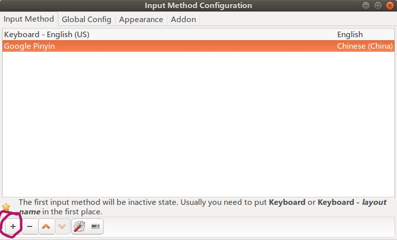
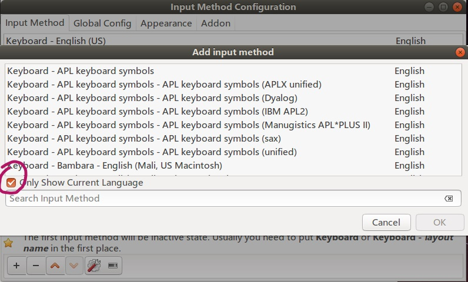
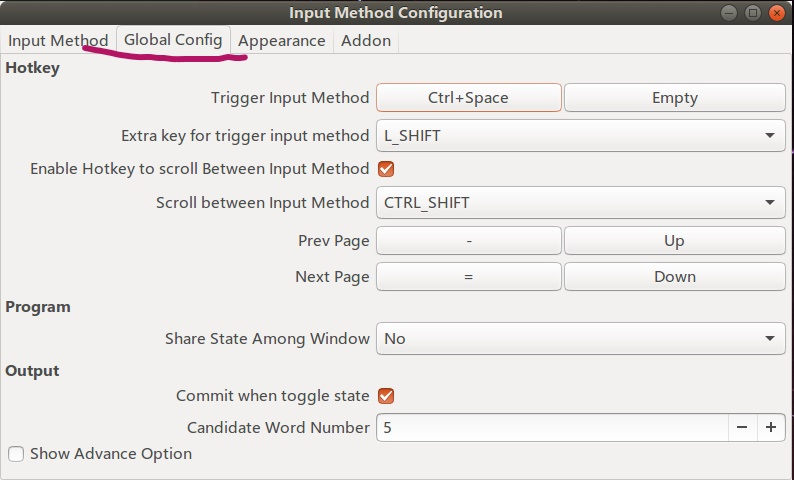

**系统版本为 Ubuntu 16.04。**  

首先安装汉语语言包：
<!--more-->

```shell
$sudo apt install language-pack-zh-hans
```

安装谷歌拼音输入法。执行这个命令，系统会自动安装 fcitx，googlepinyin，以及一些 fcitx 配置程序：

```shell
$sudo apt install fcitx-googlepinyin
```

打开 systemsettings -> Language Support，系统会自动进行语言包搜索，按照系统提示确认安装。fcitx 是一个输入法框架。如图所示，在 Keyboard input method system 中选择 fcitx：


重启电脑，fcitx 输入法框架开始运行。在终端执行 fcitx-configtool，进行输入法配置。点击 "+" 添加Google Pinyin：



若列表里没有 Google Pinyin，需要取消 Only Show Current Language 复选框：



添加完输入法之后，在 Global Config 中可以看到输入法的切换方式：



以上。