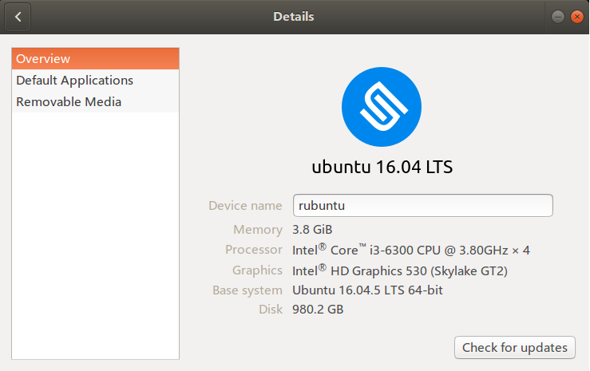
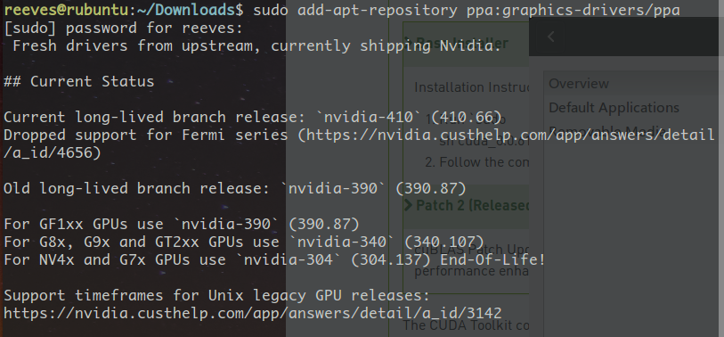
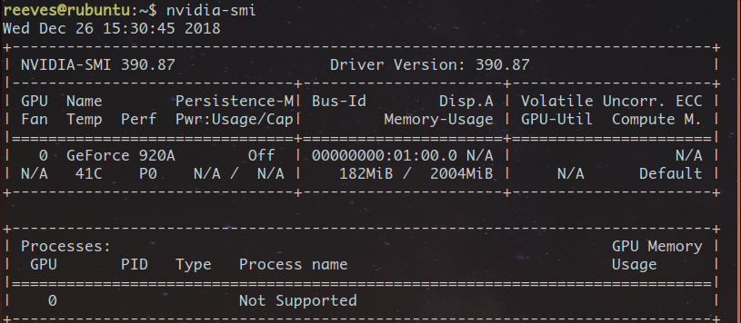
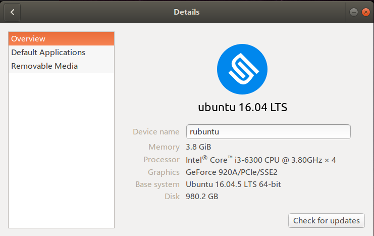

## Nvidia 驱动安装

在 All Settings ->  Details 中查看自己的设备信息，如图：
<!--more-->



Nvidia 驱动和 CUDA 版本存在着对应关系，可以在[官网](https://docs.nvidia.com/cuda/cuda-toolkit-release-notes/index.html)查看。

[这里](https://www.geforce.com/drivers)可以查看 GPU 支持的驱动版本。

推荐使用 ppa 源安装驱动，方法如下：

首先添加 ppa 源，执行如下语句：

```shell
$sudo add-apt-repository ppa:graphics-drivers/ppa
```

获取最新的软件包源，将其添加至当前 apt 库中，执行后会显示当前可供下载的最新驱动版本号，已经老的驱动版本号。如图：



最新的版本为 nvidia-410(410.66)，稍早的版本为 nvidia-390(390.87)。更新软件库信息，并下载 Nvidia 驱动：

```shell
$sudo apt update
$sudo apt install nvidia-390
```

安装三维图像库和 OpenGL 环境，并重启：

```shell
$sudo apt install mesa-common-dev
$sudo apt install freeglut3-dev
$sudo reboot
```

在终端输入 nvidia-smi，若输出如下，则说明安装成功：



All Setting -> Details 内显示 Graphics 为 Geforce 920：




在 .bashrc 中添加路径：
```shell
$export LD_LIBRARY_PATH=$LD_LIBRARY_PATH:/usr/lib/nvidia-390
```

以上。

## CUDA 安装

以 cuda8 为例，参考[博客](https://blog.csdn.net/u010837794/article/details/63251725)。

很多博客都指出要先禁用 nouveau 服务，并加入黑名单，这个步骤很麻烦，同时也是没有必要的。首先，我们来看 nouveau 是什么。nouveau 是一个开源驱动项目，是 Linux KMS（kernel mode-setting）驱动的一部分，是一个公版的显卡驱动程序，可以驱动 AMD、高通的芯片，nvidia 也参与了开发，KMS 项目是为了在文本系统Linux中显示图形界面而诞生的开源项目。也就是说，这个 nouveau 和我们安装的 nvidia 驱动是冲突的，所以是要禁止掉的。但是，如果你的系统中两者并没有发生冲突，那么再处理这个公版驱动就没有必要了。CUDA 安装指南 [Installation Guide for Linux](https://developer.nvidia.com/compute/cuda/8.0/Prod2/docs/sidebar/CUDA_Installation_Guide_Linux-pdf) 中指明了需要 Disable the Nouveau drivers，但是在具体如何禁用的时候，文档又指出了:
> The Nouveau drivers are loaded if the following command prints anything:

```shell
$lsmod | grep nouveau
```

如果执行命令后什么也没有显示，则说明 Nouveau drivers 本身就没有被使用，是不用禁用的。

直接执行如下命令：

```shell
$sudo sh cuda_8.0.61_375.26_linux.run
```

或者

```shell
 $sudo sh cuda_8.0.61_375.26_linux.run --no-opengl-libs    # 更推荐这种方式
```

按照提示一步步安装即可，注意安装驱动的选项要选择 no。

然后安装补丁 Patch 2：

```shell
$sudo sh cuda_8.0.61.2_linux.run
```

安装完成后，在环境变量中添加 CUDA，在 .bashrc 中添加：

```bash
export PATH=/usr/local/cuda-8.0/bin:$PATH
export LD_LIBRARY_PATH=/usr/local/cuda-8.0/lib64$LD_LIBRARY_PATH
```

重启电脑，即完成 CUDA 安装。

以上。

## CUDNN 安装

cudnn 需要注册 nvidia 账号才可以下载。共有三个文件：

- libcudnn6-dev_6.0.21-1+cuda8.0_amd64.deb  
- libcudnn6_6.0.21-1+cuda8.0_amd64.deb  
- libcudnn6-doc_6.0.21-1+cuda8.0_amd64.deb

命令行执行：

```shell
$sudo dpkg -i libcudnn6-dev_6.0.21-1+cuda8.0_amd64.deb
$sudo dpkg -i libcudnn6_6.0.21-1+cuda8.0_amd64.deb
$sudo dpkg -i libcudnn6-doc_6.0.21-1+cuda8.0_amd64.deb
```

安装完毕后重启终端。

输入命令： 

```shell
$nvcc -V
```
会显示 CUDA 的版本号。

进入 ~/NVIDIA_CUDA-8.0_Sample/1_Utilities/deviceQuery/，执行 make 命令：

```shell
$make
$./deviceQuery
```

显示 Result = PASS。CUDA+CUDNN 安装成功。
以上。

## tensorflow 安装

使用 pip 安装即可。
首先，在 anaconda 中创建虚拟环境：
```shell
$conda create -n tf python=3.5
```
这里最好创建 python3.5 的环境，因为后面安装的包对更高版本的支持不是太好。
tensorflow 的向下兼容性并不是很好，这里要选择好tensorflow的版本，tensorflow 和 CUDA 以及 cudnn 的版本对应关系如下，数据来自[博客](https://blog.csdn.net/oMoDao1/article/details/83241074)

|tensorflow-gpu|cuda|cudnn|python|
|:-:|:-:|:-:|:-:|
|v1.9.0|9.0|7.1.4|2.7,3.3-3.6|
|v1.8.0|9.0|7|2.7,3.3-3.6|
|v1.7.0|9.0|7|2.7,3.3-3.6|
|v1.6.0|9.0|7|2.7,3.3-3.6|
|v1.5.0|9.0|7|2.7,3.3-3.6|
|v1.4.0|8.0|6.0|2.7,3.3-3.6|
|v1.3.0|8.0|6.0|2.7,3.3-3.6|
|v1.2.0|8.0|5.1|2.7,3.3-3.6|
|v1.1.0|8.0|5.1|2.7,3.3-3.6|

根据之前安装的cuda和cudnn，我选择安装 tensorflow v1.4.0:
```shell
$source activate tf    # 进入虚拟环境 tf
$pip install tensorflow-gpu==1.4.0    # 若提示有包依赖，再安装便是
```
以上。


## mujoco安装

破解版的三个文件：mjkey.txt, mjpro150, mjpro150_linux.zip。

首先，在主目录下创建隐藏文件夹 mujoco，并将压缩包 mjpro150_linux.zip 解压到这里：
```shell
$mkdir ~/.mujoco
$cp mjpro150_linux.zip ~/.mujoco
$cd ~/.mujoco
$unzip mjpro150_linux.zip
```

然后，将 mjket.txt 复制到 ~/.mujoco 和 ~/.mujoco/mjpro150/bin :
```shell
$cp mjkey.txt ~/.mujoco
$cp mjkey.txt ~/.mujoco/mjpro150/bin
```

复制 mjpro150 到 .mujoco 中，覆盖原有的 mjpro150 文件夹：
```shell
$cp -rf mjpro150 ~/.mujoco
```
修改文件执行权限：
```shell
$sudo chmod 777 -R .mujoco
```
然后添加环境变量，在 .bashrc 中添加：
```shell
export LD_LIBRARY_PATH=~/.mujoco/mjpro150/bin${LD_LIBRARY_PATH:+:${LD_LIBRARY_PATH}}
export MUJOCO_KEY_PATH=~/.mujoco${MUJOCO_KEY_PATH}
```
运行测试：
```shell
$cd ~/.mujoco/mjpro150/bin
$./simulate ../model/humanoid.xml
```
以上。
    

## mujoco_py 安装：

首先，在 github 上下载源码：
```shell
$git clone https://github.com/openai/mujoco-py.git
```
下载下来的代码中包含 requirements.txt，需要先安装里面的依赖包：
```shell
$pip install -r requirements.txt
```
安装完依赖之后安装 mujoco_py：
```shell
$pip install -u 'mujoco-py<1.50.2,>=1.50.1'
```
安装过程中如果 gcc 报错，那么执行以下语句：
```shell
$sudo apt install libgl1-mesa-dev libgl1-mesa-glx libosmesa6-dev python3-pip python3-numpy python3-scipy
```

若出现错误：fatal error:GL/glew.g：没有那个文件或目录，解决方法：
```shell
sudo apt install libglew-dbg libglew-dev libglew1.10 libglew-dbg libglewmx-dev libglewmx1.13 glew-utils
```


安装完毕后，测试安装结果。
```shell
$cp -rf ~/Downloads/mujoco-py/xmls  ~/.local/lib/python3.5/site-packages
```
然后执行 python 代码：
```python
import mujoco_py
from os.path import dirname
model = mujoco_py.load_model_from_path(dirname(dirname(mujoco_py.__file__))+"/xmls/claw.xml")
sim = mujoco_py.MjSim(model)
print(sim.data.qpos)    # [0. 0. 0. 0. 0. 0. 0. 0. 0. 0. 0. 0.]
sim.step()
print(sim.data.qpos)
# [2.09217903e‐06 ‐1.82329050e‐12 ‐1.16711384e‐07 ‐4.69613872e‐11
# ‐1.43931860e‐05 4.73350204e‐10 ‐3.23749942e‐05 ‐1.19854057e‐13
# ‐2.39251380e‐08 ‐4.46750545e‐07 1.78771599e‐09 ‐1.04232280e‐08]
```
以上。

## 安装 gym

使用源码安装：
```shell
$git clone https://github.com/openai/gym.git
$cd gym
$sudo apt install -y python-numpy python-dev cmake zlib1g-dev libjpeg-dev xvfb libav-tools xorg-dev python-opengl libboost-all-dev libsdl2-dev swig
$pip install -e .[all]
```

运行测试程序：
```python
import gym
env = gym.make('Hero-ram-v0')
for i_episode in range(20):
    observation = env.reset()
    for t in range(100):
        env.render()
        print(observation)
        action = env.action_space.sample()
        observation,reward,done,info = env.step(action)
        if done:
            print("Episode finished after {} timesteps".format(t+1))
            break
```

补充，安装需要依赖 cmake 和 zliblg-dev，
```shell
$sudo apt install cmake libz-dev
```
以上。


## baseline 的安装

baseline 需要 python3.5 及其以上的版本。
安装依赖：
```shell
$sudo apt install libopenmpi-dev
```

baseline 安装方法如下：
```shell
$git clone https://github.com/openai/baseline.git
$cd baseline
$pip install -e .
```

若出现错误
> ERROR: GLEW initalization error: Missing GL version

解决办法为，在 .bashrc 中添加：
```shell
$export LD_PRELOAD=/usr/lib/x86_64-linux-gnu/libGLEW.so:/usr/lib/nvidia-390/libGL.so
```

若出现错误
> AssertionError: TensorFlow needed, of version above 1.4
 
解决办法为：
```shell
$sudo ldconfig /usr/local/cuda/lib64/
```

测试安装结果：
```shell
$cd ~/baseline/baseline/her/experiment/
$python train.py --num_cpu=2
```

训练完毕后调用：
```shell
$python play.py /tmp/openai-2019-01-04-13-26-30-141299/policy_best.pkl  # 后面这个参数是训练结束后输出的值
```
以上。
