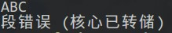
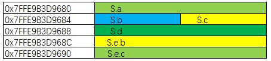

本文为一份面试题，附带复习一些基础知识。
<!-- more -->

注：以下题目均在32位linux环境下，小端字节序。

1. 以下语句分别输出什么？

```C
char str1[] = "abc";
char str2[] = "abc";
const char* str3 = "abc";
const char* str4 = "abc";
cout << boolalpha << (str1 == str2) << endl;
cout << boolalpha << (str3 == str4) << endl;
```
答：false  true.  具体的解释请查看我之前写的博客[剑指 offer 读书笔记：编程语言篇](https://mr-solution.github.io/Notes/2019/06/22/%E5%89%91%E6%8C%87-offer-%E8%AF%BB%E4%B9%A6%E7%AC%94%E8%AE%B0/#more)第1.4节。

2. 对于"`int i;`"，"`(!!i)`"等价于什么？  
A. (i!=0)  
B. (i == 0)  
C. (i)  
D. 非法语句  

答：~~C。`int i`会默认初始化`i`为 0，所以`!!i`返回false，B选项返回 true，C返回 false。~~  
> 内置类型变量是否自动初始化取决于变量定义的位置。在函数体外定义的变量都初始化成 0，在函数体里定义的内置类型变量不进行自动初始化。
> ----《C++ Primer》    

所以这道题的答案应该为 D ，非法语句。  
很多编译器会做一些“多余”的操作，帮助代码作者为变量赋值，严格按照 C++ 设计标准来讲，如果 i 是一个全局变量，在函数之外（包括main函数）声明，那么 i == 0，!!i 等同于 false。若 i 是一个局部变量，则会报错（gcc编译器不会报错）。所以这道题考察点应该为：必须为变量赋初值。
> 确定对象被使用前已先被初始化。  ----《Effective C++：条款04》


3. 定义`char *(*a)[3][4];`，则变量a占用的内存空间为多少字节？  

答：4，可以用 sizeof(a)来验证。首先，理清一个运算优先级的问题，`[]`的优先级高于`*`，`()`的优先级高于一切。所以，`a`先同`*`结合，即`a`是一个指针，`*a`再同`[]`结合，即`*a`是一个3x4的二维数组，再与`*`结合，即数组内存放的是指向`char`型数据的指针。`a`是一个指针，所以`a`占用的内存空间只与系统的寻址能力有关，32位系统中，指针占32位，4字节。  
若定义`char **a[3][4]`，则变量`a`占用内存 48 字节。因为 a 是一个二维数组，存放的是指向char型指针的指针，需要空间3x4x4=48。  

> 数组名只有在表达式中使用时，编译器才会为它产生一个指针常量，但是有两个例外——sizeof 操作符和单目操作符 &。

4. 以下程序的运行结果是什么？屏幕上面显示什么？（运行环境为UNIX类系统）
```C
int main(void) {
    printf("ABC\n123");
    printf("xyz");
    *(int *)0=0;
    return 0;
}
```

答：屏幕上显示结果为：  
  
这道题主要考察了两点。第一是非法使用空指针使程序崩溃。第二是`printf()`函数何时打印内容。
先说第一点，第四行语句`*(int *)0=0;`，第一眼看上去这行代码没有变量，只有两个数字 0 0，第一个数字0之前的`(int *)`是强制类型转换，所以这句话的意思是将0强制转换为指向 int 的指针，然后最左边的`*`是解引用操作符，返回指针指向的内容，所以这行代码的意思是将0指针指向的内容赋值为整型数字 0。我们知道在C语言中，空指针是NULL，而 NULL 在 C 语言中的定义就是 0，也就是说这行代码等价于`*(int *)NULL=0;`，意思是将 NULL 指针指向的内容赋值为 0。这在 C 语言中是非法的，一般我们需要程序强制崩溃的时候会这么用。所以，这段代码会输出段错误，并终止运行。那么为什么"123"和"xyz"没有被打印出来呢？这就是这道题的第二个考点，用`printf()`输出时是先输出到缓冲区，然后再从缓冲区送到屏幕上。若缓冲区已满，则将缓冲区内容输出到屏幕上，若未满，则需要手动使用`fflush(stdout)`将内容输出，或者使用`\n`，`\r`打印内容，若没有手动打印缓冲区，则在程序运行结束时打印。这里"ABC"之后有`\n`，所以"ABC"被打印出来，之后的"123"和"xyz"则进入缓冲区，因为没有手动刷新，所以必须等程序运行完才能打印在屏幕上，然后程序崩溃了，所以无法打印出来。

5. 如下代码输出什么？
``` C
#define SQR(x) (x * x)
int main() {
    int a,b=3;
    a = SQR(b+2);
    printf("a=%d\n",a);
    return 0;
}
```

答：11。这道题比较基础，考察点在 #define 预编译命令执行的是简单的文本替换，所以`a = SQR(b+2)`就等价于`a = b+2 * b+2`，a = 3 + 2 * 3 + 2 = 11.

6. 求下面结构体的大小。
``` C
struct B {
    int b;
    char c;
};
typedef struct {
    int a;
    char b;
    short c;
    char d;
    B e;
} S;
```
求 sizeof(S) = ？

答：20。
可以参考[剑指 offer 读书笔记：编程语言篇](https://mr-solution.github.io/Notes/2019/06/22/%E5%89%91%E6%8C%87-offer-%E8%AF%BB%E4%B9%A6%E7%AC%94%E8%AE%B0/)1.2节。
本题中 struct 的内存对齐情况为:  


7. 请问下面这个代码能否编译通过，不行是什么原因，如果可以的话，请问执行结果是什么？
``` C 
class Base 
{
    public:
        Base() {VFun();}
        virtual void VFun(){printf("Base ....\n");}
};
class DBase:public Base 
{
    public:
        DBase(){}
        virtual void VFun(){printf("DBase ....\n");}
};
int main(int argc, char *argv[]) {
    DBase *pDBase = new DBase();
    return 0;
}
```
答：可以编译通过，输出为：`Base ....`。
这道题应该是想考察C++的构造函数析构函数的继承问题，以及多态性。但是题目覆盖的面不广。这里做一些补充。
> 理解 C++ 中继承层次的关键在于理解如何确定函数调用。确定函数调用遵循以下四个步骤:
> 1. 首先确定进行函数调用的对象、引用或指针的静态类型。
> 2. 在该类中查找函数，如果找不到，就在直接基类中查找，如此循着类的继承链往上找，直到找到该函数或者查找完最后一个类。如果不能在类或其相关基类中找到该名字，则调用是错误的。
> 3. 一旦找到了该名字，就进行常规类型检查，查看如果给定找到的定义，该函数调用是否合法。
> 4. 假定函数调用合法，编译器就生成代码。如果函数是虚函数且通过引用或指针调用，则编译器生成代码以确定根据对象的动态类型运行哪个函数版本，否则，编译器生成代码直接调用函数。  
> ——《C++Primer》

C++ 可以用基类指针指向派生类对象，这时候通过基类指针进行调用，这样就会直接在基类中进行查找函数名：
``` C
Derived d;
Base *p = &d;
d.func();    // 执行派生类中的 func()
p.func();    // 执行基类中的 func()
```
参考博客：[继承](https://blog.csdn.net/iicy266/article/details/11906697)，[多态](https://blog.csdn.net/ijn842/article/details/80936236)

8. 这段代码输出什么?或这段代码有没问题？
``` C
int main() {
    string Str1,Str2; 
    Str1.resize(5);
    Stri2.reserve(5);
    memcpy(Str1.data(),"abc",3);
    cerr << Str1.c_str() << endl;
    memcpy(Str2.data(),"abc",3);
    cerr << Str2.c_str() << endl;
}
```
答：有问题。C++ 的 string 类不能使用 memcpy, memset 等一系列内存操作。因为 memcpy 执行的是浅拷贝，而 string 类因为用指针自行管理内存，是不能进行浅拷贝的。所以要养成一个好的编程习惯，就是在定义 struct 结构体的时候，成员最好不要使用 string 类，而是用 char 数组来代替。同时不要使用 memcpy 函数，而是自己重载结构体的复制操作符，通过赋值操作符来对 struct 进行复制。

9. 采用 UDP 通信，如果 Client 端 sendto 一段 1024 字节的 bug，server 端循环调用 recvfrom(fd,buf,64,0)，能否收完，能收的话需要调用几次，不能收完原因是什么？

答：不能收完，UDP 协议是面向报文的，应用层交给 UDP 多长的报文，UDP 就照样发送，即一次发送一个报文。一个报文发送 1024 字节的数据，server 端成功收到这个报文之后，只能收到 64 字节，其余部分被丢弃。

对于IP协议来说，IP包的大小由 MTU 决定，MTU 在以太网中的值为 1500 字节，即链路层可以传输的数据帧最大长度为 1500 字节，超过这个长度的数据报将在 IP 层分片。

sendto和recvfrom 是UDP协议的两个主要方法：
`sendto()`向一指定目的地发送数据，`recvfrom()`接收一个数据报并保存源地址。

可以编码验证本题：
``` C
// udp_server.c
#include <stdio.h>
#include <sys/types.h>
#include <sys/socket.h>
#include <netinet/in.h>
#include <arpa/inet.h>
#include <unistd.h>
#include <stdlib.h>
#include <string.h>

#define UDP_TEST_PORT 50001

int main(int argC, char* arg[]) {
    struct sockaddr_in addr;
    int sockfd, len = 0;    
    int addr_len = sizeof(struct sockaddr_in);
    char buffer[256];   

    /* 建立socket，注意必须是SOCK_DGRAM */
    if ((sockfd = socket(AF_INET, SOCK_DGRAM, 0)) < 0) {
        perror ("socket");
        exit(1);
    }

    /* 填写sockaddr_in 结构 */
    bzero(&addr, sizeof(addr));
    addr.sin_family = AF_INET;
    addr.sin_port = htons(UDP_TEST_PORT);
    addr.sin_addr.s_addr = htonl(INADDR_ANY); // 接收任意IP发来的数据
    /* 绑定socket */
    if (bind(sockfd, (struct sockaddr *)&addr, sizeof(addr))<0) {
        perror("connect");
        exit(1);
    }

    while(1) {
        bzero(buffer, sizeof(buffer));
        // len = recvfrom(sockfd, buffer, sizeof(buffer), 0, (struct sockaddr *)&addr ,&addr_len);
        len = recvfrom(sockfd, buffer, 64, 0, (struct sockaddr *)&addr ,&addr_len);
        /* 显示client端的网络地址和收到的字符串消息 */
        printf("Received a string from client %s, string is: %s\n", inet_ntoa(addr.sin_addr), buffer);
        /* 将收到的字符串消息返回给client端 */
        sendto(sockfd,buffer, len, 0, (struct sockaddr *)&addr, addr_len);
    }
    return 0;
}

// udp_client.c
#include <stdio.h>
#include <sys/types.h>
#include <sys/socket.h>
#include <netinet/in.h>
#include <arpa/inet.h>
#include <unistd.h>
#include <stdlib.h>
#include <string.h>

#define UDP_TEST_PORT 50001
#define UDP_SERVER_IP "127.0.0.1"

int main(int argC, char* arg[]) {
    struct sockaddr_in addr;
    int sockfd, len = 0;    
    int addr_len = sizeof(struct sockaddr_in);      
    char buffer[256];

    /* 建立socket，注意必须是SOCK_DGRAM */
    if ((sockfd = socket(AF_INET, SOCK_DGRAM, 0)) < 0) {
        perror("socket");
        exit(1);
    }
    /* 填写sockaddr_in*/
    bzero(&addr, sizeof(addr));
    addr.sin_family = AF_INET;
    addr.sin_port = htons(UDP_TEST_PORT);
    addr.sin_addr.s_addr = inet_addr(UDP_SERVER_IP);

    while(1) {
        bzero(buffer, sizeof(buffer));
        printf("Please enter a string to send to server: \n");

        /* 从标准输入设备取得字符串*/
        len = read(STDIN_FILENO, buffer, sizeof(buffer));

        /* 将字符串传送给server端*/
        sendto(sockfd, buffer, len, 0, (struct sockaddr *)&addr, addr_len);

        /* 接收server端返回的字符串*/
        len = recvfrom(sockfd, buffer, sizeof(buffer), 0, (struct sockaddr *)&addr, &addr_len);
        printf("Receive from server: %s\n", buffer);
    }
    return 0;
}
```


10. tcp通信，client 端循环调用 send(fd,buf,1) 1024 次发给 server，从 server 端捉包，客户端总共发了几个包过来？

答：1024。

11. 有个文件，内容如下：  
1111|33333|44444|6666  
4adf|33333|fafdfd|adfdfa  
dddd|22222|dadffd|adfdfasf  
如果想把第二列==33333的行全部输出来，请问用shell脚本，该怎么写？

答：linux 中处理文本最有用的工具就是 awk。本题的解决方法就是：
`awk -F '|' '$2==33333 {print $0}' file` 
写成脚本文件：
``` bash
#!/bin/bash
awk -F '|' '$2==33333 {print $0}' $1
```
awk命令的基本语法:  
awk -F 分隔符 '/模式/{动作}' 输入文件

动作一定要用花括号括起，多个动作之间用;号分开。

模式可以是正则表达式、条件表达式或两种组合，如果模式是正则表达式要用 / 定界符。

只有模式没有动作结果和 grep 一样。

在本题中，'|'是分隔符，`$2==33333`是模式，`{print $0}`是动作

更多关于awk命令的知识可以参看[博客](http://www.zsythink.net/archives/1336)。


12. 假设有一个位图数据结构定义为：`uint32_t bitmap[BSIZE];`，请写出用于判断位图中第 bit 位是否为 1 的如下宏的实现`#define is_bit_set(bit)`。

答：
``` C
#define is_bit_set(bit) \
do { \
    if (bitmap[bit] > 0) \
        cout << "第" << bit << "位为1" << endl; \
    else \
        cout << "第" << bit << "位不为1" << endl; \
} while(0) \
//第二种写法
#define is_bit_set(bit) (bitmap[bit] > 0 ? true:false)
```

因为宏定义是简单的文本替换，所以为了防止在 if...else... 语句中使用宏导致的不匹配问题，避免在引用时出错，所以宏定义函数我们一般要用 `do {...} while(0)`，结尾不加分号，因为宏只是简单替换，引用宏的语句后面要加分号。

判断宏定义对不对，直接带入代码即可。

13. 编程实现二分查找算法，函数输入为一升序的整数数组及要查找的整数。如果查找不到则返回大于 Key 的最小元素(不用递归)。

答：
``` C
/*
因为要返回两种情况，所以需要传引用一个参数 res 用来表示查找是否成功。res==1 表示成功，返回 key 在 data 中的 index；res == 0 表示失败，返回比 key 大的最小元素。
*/
int binarySearch(int data[], int len, int key, int &res) {
    int left = 0;
    int right = len-1;
    while (left<=right) {
        int mid = (left + right)/2;
        if(data[mid] > key) {
            right = mid - 1;
        }
        else if (data[mid] < key) {
            left = mid + 1;
        }
        else {
            res = 1;
            return mid;
        }
    }   
    res = 0;
    return data[left];
}
```

14. 写一个函数，倒转英文句子。例如"i am on duty today"，处理之后变为"today duty on am  i"。函数原型：void a(char *pStr, int iLen)，其中 pStr 是输入输出参数，ilen是字符串长。

答：很显然，倒装要用栈来实现。
``` C++
#include <iostream>
#include <stack>
#include <string>

using namespace std;

int main() {
    string str;
    string word;
    getline(cin, str);
    cout << str << endl;
        
    stack<string> st; 

    int i = 0;
    while (str.length() > 0 && i >= 0) {
        i = str.find(" ");
        word = str.substr(0,i);
        str = str.substr(i+1,str.length());
        st.push(word);
    }          
          
    while (!st.empty()) {
        cout << st.top() << " ";
        st.pop();
    }   
    cout << endl;       
    return 0;
}
```

15. 10亿个随机数中，取出最大 10 个出来,说下实现原理:

答：这是一个典型的 [TopN](https://blog.csdn.net/bntX2jSQfEHy7/article/details/83155256) 问题。

从 M 个数中选出 Top N，最直接的想法是取前 N 个数字作为标杆，然后遍历数据，每一个数据都跟 N 个标杆对比，然后淘汰标杆中最小的数字，这样的话只需要遍历一遍数据，时间复杂度为 O(MN)，因为 N 一般是一个远远小于 M 的数字，所以这个复杂度可以接受。但是这并不意味着这样的算法就可以了。因为此类问题中，M 通常都是一个特别大的数字，N 再小，乘以 M 之后也会变得非常大，在本题中 10x10亿 等于 100 亿次操作，这是很大的运算开支。所以这样的算法是不行的，需要进一步优化。

我们来理一下我们的思路：选取标杆，每一个数据去和标杆比对。这是一个两步走的思路，一是遍历，二是对比，遍历这一步没办法继续优化了，时间复杂度已经是 O(M) 了，若要每一个数据都参与对比，那么这就是最低复杂度了。只能优化对比这一步，在上面的思路中，每一个数据都要和标杆对比，然后替换掉标杆中最小的数字，每一个对比的过程要 N 步。但是实际上真正起作用的只有替换最小数这一步，其他的 N-1 步实际上只是对比，并没有产生任何后续操作，所以我们想能不能只跟标杆数组中的最小数字做对比。如果对标杆数组做一个排序，可以实现跟最小数字做对比，但是对比之后若产生了替换的需要，那么我们需要对新的标杆数组做排序，常见的排序算法中，时间复杂度低的归并排序、堆排序，其最好最坏情况的时间复杂度都为 O(NlgN)，这样反而使整体的复杂度更高了。所以不可取。

一般情况下，要想取出一组数据中的最小值，最常用的方法是建立小顶堆，小顶堆的插入时间复杂度为 O(lgN) 优于 O(N)，所以可以采用小顶堆，每次跟堆顶元素对比，若产生替换需求的话，则替换掉堆顶元素，插入新元素，这样的话，整体的算法时间复杂度为 O(MlgN)。如果是要从 10 亿数字中找出 1000 个最小数字的话，那么按照最开始的思路，需要 1000 x 10亿大概10000亿次操作，如果按照后面的思路，需要 lg1000 x 10亿次，大概等于100亿。
