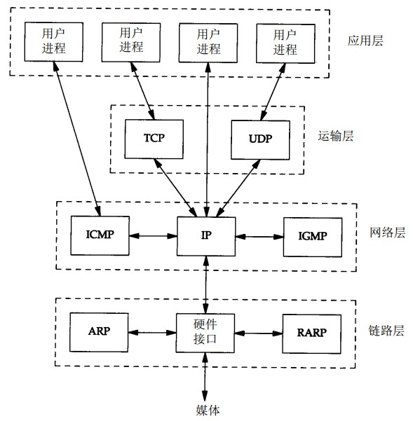

TCP/IP 协议族是一个四层协议系统，自底向上分别为链路层、网络层、运输层和应用层，每一层分别负责不同的通信功能。

<!-- more -->

## TCP/UDP

TCP和UDP协议位于四层模型的运输层。IP 协议位于网络层。

### 简述TCP和UDP的区别

TCP提供可靠的通信传输，而UDP则常被用于广播和把细节控制交给应用的通信传输。两者的区别大致如下：

1. TCP是面向连接的，UDP是无连接的
2. TCP提供可靠的服务，UDP无法保证
3. TCP面向字节流，UDP面向报文
4. TCP数据传输速度慢，UDP传输速度快

> 面向报文的传输方式是应用层交给 UDP 多长的报文，UDP 就照样发送，即一次发送一个报文。因此，应用程序必须选择合适大小的报文。若报文太长，则 IP 层需要分片，降低效率。若太短，会是 IP 太小。UDP 对应用层交下来的报文，既不合并，也不拆分，而是保留这些报文的边界。  
> TCP 是面向字节流的，它把上面应用层交下来的数据看成无结构的字节流来发送。应用数据被分割成 TCP 认为最适合发送的数据块。TCP还能提供流量控制。TCP 连接的每一方都有固定大小的缓冲空间。TCP 的接收端只允许另一端发送接收端缓冲区所能接纳的数据。这将防止较快主机致使较慢主机的缓冲区溢出。

> 什么是保护消息边界和流呢？保护消息边界，就是指传输协议把数据当作一条独立的消息在网上传输,接收端只能接收独立的消息.也就是说存在保护消息边界，接收端一次只能接收发送端发出的一个数据包。而面向流则是指无保护消息保护边界的，如果发送端连续发送数据，接收端有可能在一次接收动作中，接收两个或者更多的数据包.

### TCP三次握手和四次挥手

TCP 通过三次握手来建立连接。三次握手的目标是使数据段的发送和接收同步。同时也向其他主机表明其一次可接收的数据量（窗口大小），并建立逻辑连接。

第一次握手，客户端发送连接请求，将 SYN(同步序号) 置1，Sequence Number 设为 x 并发送给服务端，然后，客户端进入 SYN_SEND 状态，等待服务器确认；
第二次握手，服务器收到客户端的请求，设置Acknowledgement Number为 x+1，同时将 SYN 置1，Sequence Number设为y。服务器将 SYN + ACK 字段放到一个报文中，发送给客户端，此时服务器进入 SYN_RECV 状态；
第三次握手，客户端接受到 SYN_ACK 报文，然后将 Acknowledgement Number 设置为y+1，向服务器发送 ACK 报文，之后客户端和服务器都进入 ESTABLISHED 状态，完成三次握手。

TCP 协议终止连接需要四次挥手。
首先进行关闭的一方（即发送第一个FIN）将执行主动关闭，而另一方执行被动关闭。
首先，主动关闭方发送 FIN 到被动方。
然后，被动方发回一个确认 ACK，确认收到的 seq。
第三次挥手来自被动方，被动方发送 FIN
到主动方。
最后，主动方收到 FIN 之后返回一个 ACK 确认，TCP连接到此终止。

**Q：为什么要三次握手**
A：为了实现数据的可靠传输，TCP 协议中，通信双方都必须有一个有序的消息队列，双方都要维护一个序列号，以标识发送出去的数据包。三次握手的过程即是通信双方相互告知序列号起始值，并确认对方已经收到了序列号起始值的必经步骤。第一次握手，客户端将自己的序列号 Seq 告知服务器。第二次握手，服务器告诉客户端我已收到你的seq（acknowledge），同时发送服务器的 seq。 第三次握手，是客户端向服务器确认我已收到你的 seq 的过程。所以必须要有三次握手。

**Q：为什么要四次挥手**
A：因为 TCP 连接时全双工的，即数据在两个方向上能同时传递，A 可以发送给 B，反过来 B 也可以发送给 A。而终止一个方向的连接需要两次握手，一次FIN请求一次确认。所以终止连接总共需要四次握手。

### TCP 首部

如下表所示：

TCP 首部是没有 ip 地址的，ip 地址由网络层的 IP 协议来封装。

**TCP 首部只有端口号没有 ip 地址，那么网络层怎么知道目的 ip 地址的呢？**
DNS 解析出 ip 地址后建立 socket，然后进行 connect 系统调用的时候，ip 地址实际上是作为参数传进去了，只不过 TCP 首部封装的时候没放进去，而是放在 IP 首部里面去了。

**Q：为什么在 TCP 首部的开始便是源和目的的端口号？**
A：因为在IP地址A和B之间可以建立很多个TCP连接，为了高效的区别这些连接，就把端口号放在首部开始。

### TCP短连接、长连接和保活机制

TCP连接有长连接和短连接之分，短连接是指数据交互完毕后，主动释放连接，通常浏览器访问服务器的时候就是短连接。
长连接是指 client 和 server 完成一次交互之后，它们之间的连接并不会主动关闭，后续的读写操作会继续使用这个连接，数据库、通信软件的连接就是长连接。

长连接的环境下，进行一次数据交互后，很长一段时间内无数据交互时，客户端可能意外断电、崩溃、重启，这些 TCP 连接并未来得及正常释放，那么，连接的另一方并不知道对端的情况，它会一直维护这个连接，长时间的积累会导致非常多的半打开连接，造成端系统资源的消耗和浪费，且有可能导致在一个无效的数据链路层面发送业务数据，结果就是发送失败。所以服务器端要做到快速感知失败，减少无效链接操作，这就有了 TCP 的Keepalive（保活探测）机制。

保活功能主要是为服务器应用程序提供的。服务器应用程序希望知道客户主机是否崩溃，从而可以回收相应的资源。

在连接空闲两个小时后，在一个连接上发送一个探查分组来完成保活功能。可能会发生 4 种不同的情况：
1. 客户端正常运行，服务器将保活定时器复位。
2. 客户主机已经崩溃，并且关闭或者正在重新启动。在任何一种情况下，客户的 TCP 都没有响应。服务器将不能够收到对探查的响应，并在 75 秒后超时。服务器总共发送 10 个这样的探查，每个间隔 75 秒。如果服务器没有收到一个响应，它就认为客户主机已经关闭并终止连接。
3. 客户主机崩溃并已经重新启动。这时服务器将收到一个对其保活探查的响应，但是这
个响应是一个复位，使得服务器终止这个连接。
4. 客户主机正常运行，但是从服务器不可达。这与状态 2 相同，因为 TCP 不能够区分状态 4 与状态 2 之间的区别，它所能发现的就是没有收到探查的响应。

**Q：linux中，一个端口能接受TCP连接的数量是多少？**
A：理论上是没有上限的，但由于linux中一切都是文件，TCP连接的数量还是受限制的。
命令`ulimit -n`可以查看同一时间最多可开启的文件数，默认为1024。`ulimit -n NUMBER`可以修改该值为指定 NUMBER。

### TCP超时重传

TCP 协议是一种面向连接的可靠的传输层协议，它保证了数据的可靠传输，对于一些出错，超时丢包等问题 TCP 设计了超时与重传机制。其基本原理：在发送一个数据之后，就开启一个定时器，若是在这个时间内没有收到发送数据的 ACK 确认报文，则对该报文进行重传，在达到一定次数还没有成功时放弃并发送一个复位信号。

#### TCP协议中的计时器

对每个连接，TCP 管理 4 个不同的定时器：

1. 重传定时器使用于当希望收到另一端的确认。
2. 坚持(persist)定时器使窗口大小信息保持不断流动，即使另一端关闭了其接收窗口。
3. 保活(keepalive)定时器可检测到一个空闲连接的另一端何时崩溃或重启。
4. 时间等待计时器。在四次挥手的时候使用的。结束连接时（即客户端发送完 ACK包之后），客户端还要等待 2MSL（MSL=maxinum segment lifetime最长报文生存时间，2MSL 就是两倍的 MSL）才能真正的关闭连接。

在传输数据过程中： 
1. 主机 A 发送数据给主机 B，主机 B 没有收到数据包，丢包了  
2. 如果主机 A 在一个特定时间间隔内没有收到主机 B 发来的确认应答，就会认为发生了丢包，从而重发消息。   
 
也有这种可能： 
主机 B 收到了数据包，它发送 ACK 确认包时，主机 A 未能接收到，丢包了。
这时，主机 A 认为主机 B 没有接收到数据包。会发生重传。

### TCP 窗口机制

[一篇带你读懂TCP之“滑动窗口”协议](https://blog.csdn.net/Michael_HM/article/details/88913284])

在TCP协议当中窗口机制分为两种：  
1.固定的窗口大小  
2.滑动窗口  

所谓窗口，就是一次可接收的数据量，在 TCP 首部用 16 位长度来控制。发送方根据这个数据来计算自己最多能发送多长的数据。如果发送方收到接受方的窗口大小为 0 的 TCP 数据报，那么发送方将停止发送数据，等到接受方发送窗口大小不为 0 的数据报的到来。 

TCP 通过滑动窗口的概念来进行流量控制。设想在发送端发送数据的速度很快而接收端接收速度却很慢的情况下，为了保证数据不丢失，显然需要进行流量控制，协调好通信双方的工作节奏。所谓滑动窗口，可以理解成接收端所能提供的缓冲区大小。TCP 利用一个滑动的窗口来告诉发送端对它所发送的数据能提供多大的缓冲区。由于窗口由 16 位 bit 所定义，所以接收端 TCP 能最大提供 65535 个字节的缓冲。由此，可以利用窗口大小和第一个数据的序列号计算出最大可接收的数据序列号。 

## IP层

IP 首部：

IP协议提供“尽力交付”，IP 协议负责传递数据，同一层的 ICMP 协议负责差错控制。

ICMP 协议直接服务于应用层，详见开篇图，ping 命令使用 ICMP 协议，既不是 TCP 报文也不是 UDP 报文，是 ICMP 报文。ICMP 报文首部包含了差错类型、代码和校验和。

**Q：在浏览器中输入网址执行之后会发生什么？**
A：首先，浏览器通过 DNS 解析出域名的 IP 地址，然后浏览器发起一个到该 IP 地址的 HTTP 会话，然后通过运输层的 TCP 协议封装数据包，传入网络层。网络层将会话请求封装成报文段，添加源和目的端口，然后在 IP 层查找目的端。通过查找路由表，数据报被发送到服务器。

**Q: IP 层是“尽力交付”的不可靠协议，TCP如何以来IP层保障数据可靠传输？**
A：TCP有滑动窗口，确保对方的缓冲不溢出；对发送的数据包有编号，有 ACK 确认机制，确保数据传输过去后要收到对方的回复才可以继续发送；有超时机制，一定时间收不到对方的回复就会重发，若干次重发后仍然没收到就表示对方断掉了；数据包有校验和，对方校验发现和你发送过去的不一样，就表明数据在传输过程中错了，要求重传。

## TCP分段与IP分片

因为UDP是面向报文的，不会自己进行分段，当长度超过了MTU时，会在网络层进行IP分片。所以这里不讨论UDP的分段问题。

对 IP 分片的数据报来说，即使仅仅丢失一片数据也要又一次传整个数据报（既然有重传。说明运输层使用的是具有重传功能的协议。如TCP协议）。这是因为 IP 层本身没有超时重传机制----由更高层（比方 TCP）来负责超时重传。当来自 TCP 报文段的某一段（在 IP 数据报的某一片中）丢失后。TCP 在超时后会重发整个 TCP 报文段，该报文段相应于一份 IP 数据报（可能有多个 IP 分片），没有办法仅仅重传数据报中的一个数据分片。这是因为，上层协议（TCP）并不知道 IP 协议是如何对数据进行分片的，IP 仅仅知道哪一片数据报丢失了是没有作用的，还是要重新打包整份数据。

IP 层根据 MTU 对数据报的长度做限制，超过这个长度就要进行分片传输，在分片时，除最后一片外，其他每一片中的数据部分（除 I P首部外的其余部分）必须是 8 字节的整数倍。

最大报文段长度（MSS，Maximum Segment Size）表示 TCP 传往另一端的最大块数据的长度。当一个连接建立时，连接的双方都要通告各自的 MSS。MSS 在 TCP 首部的可选字段中指明。

TCP 分段的原因是 MSS，IP 分片的原因是 MTU。因为一直有 MSS<=MTU，非常明显。分段后的每一段 TCP 报文段再加上 IP 首部后的长度不可能超过 MTU，因此也就不需要在网络层进行 IP 分片了。因此 TCP 报文段非常少会发生 IP 分片的情况。

## 子网掩码

子网掩码是一个应用于 TCP/IP 网络的 32 位二进制值，每节 8 位，必须结合 ip 地址对应使用。
子网掩码 32 位都与 ip 地址 32 位对应，如果某位是网络地址，则子网掩码为 1，否则为 0。
子网掩码可以通过与 ip 地址“与”运算，分离出 ip 地址中的网络地址和主机地址，用于判断该IP地址是在局域网上，还是在广域网上。
子网掩码一般用于将网络进一步划分为若干子网，以避免主机过多而拥堵或过少而 ip 浪费。

子网掩码可以分离出 ip 地址中的网络地址和主机地址  
子网掩码可以分离出 ip 地址中的网络地址和主机地址  
子网掩码可以分离出 ip 地址中的网络地址和主机地址  

A类IP地址，第一节为网络地址，其余三节为主机地址，故掩码为"11111111.00000000.00000000.00000000"  
A类网络缺省子网掩码：255.0.0.0  
B类网络缺省子网掩码：255.255.0.0  
C类网络缺省子网掩码：255.255.255.0  

子网掩码可用来判断任意两台计算机的 ip 地址是否属于同一子网络。具体说就是两台计算机各自的 ip 地址与子网掩码进行与运算后，如果得出的结果是相同的，则说明这两台计算机是处于同一个子网络的，可以直接通讯。  
假设子网掩码为 255.255.255.0，两个 ip 地址为 192.168.1.18 和 192.168.1.125，与子网掩码与运算之后得到的结果都是 192.168.1.0，说明这两个 ip 地址位于同一子网。

**Q：为什么要划分子网？**
A：同一子网内的主机处于同一广播域。在同一广播域中有这么多主机，网络会因为广播通信而饱和。另一方面，ip 地址资源越来越少。为实现更小的广播域，就需要进一步分成更小的网络。划分子网后，通过使用掩码，把子网隐藏起来，使得从外部看网络没有变化，这就是子网掩码的作用。

计算子网掩码的时候根据子网的主机数计算即可。  

子网掩码划分子网的时候，子网主机号全0全1不能用。假设 ip 为 192.168.1.0，子网掩码为 255.255.255.0，则子网 ip 范围为 192.168.1.1 - 192.168.1.254。

下列选项中，属于"10.174.20.176/28"该网段的有效 ip 地址是：  
A 10.174.20.174  
B 10.174.20.186  
C 10.174.20.191  
D 10.174.20.192  
答："10.174.20.176/28"表示一个子网号"10.174.20.176"，其子网掩码前 28 位为有效位（1），即子网掩码为"1111 1111.1111 1111.1111 1111.1111 0000","255.255.255.240"。176 二进制为 1011 0000，同子网掩码与运输之后，得到子网的 ip 范围为"10.174.20.1011 0001" - "10.174.20.1011 1110"，177 - 190。选 B。
